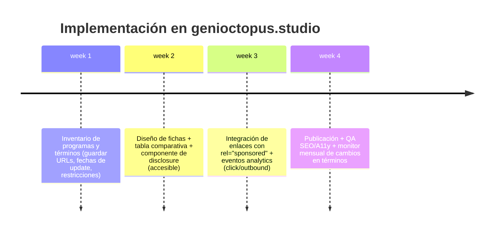

# Programas de afiliados, referidos y monetización pasiva para recomendar hosting, plataformas web y herramientas relacionadas con SEO y accesibilidad en genioctopus.studio

## Resumen ejecutivo

Este informe compara programas de afiliados/referidos (y alternativas cercanas como “partner/referral fees” o “créditos”) para integrar recomendaciones monetizables en **genioctopus.studio** (entity["organization","Genioctopus Studio","website studio brand"]), pensando en audiencias de diseño y desarrollo web en entity["country","Argentina","south american country"] y LATAM, con objetivo de **maximizar ingresos pasivos sin degradar UX, SEO ni accesibilidad**.

Hallazgos principales (con énfasis en condiciones públicas/ofticiales y términos legales):

- Los programas más “afiliado clásico” (link → compra → comisión) y con **mejor relación simplicidad/potencial** en general fueron **Kinsta** (bono + comisión recurrente “de por vida” y cookie de 60 días) citeturn10view0turn10view1turn11view0, **Webflow** y **Framer** (ambos con **50%** sobre la suscripción durante **12 meses** y cookie de 90 días, con pagos vía PayPal/Stripe según plataforma) citeturn7view1turn6view1turn5view0turn4view1, y **Cloudways** (hasta **$125** por venta o modelo híbrido con $30 + 7% “lifetime”, cookie 90 días; umbrales claros) citeturn20view0turn17view0turn18view2.  
- En hosting “mainstream” con onboarding más masivo, **SiteGround** publica comisiones por volumen y moneda (USD/EUR/GBP/AUD) y pagos semanales (PayPal/Wire, con reglas de revisión/hold) citeturn27view0turn27view2turn27view1; **Bluehost** declara $65 por venta y cookie 30 días, y su blog describe tiempos/umbral mínimos (p. ej., $10) citeturn22search2turn22search12.  
- Para infraestructura “developer-first”, **DigitalOcean** ofrece **dos vías distintas**: (a) **affiliate** (10% mensual durante 1 año, vía CJ) citeturn16view0turn16view1 y (b) **referral credits** ($200/60 días para el referido y $25 en crédito para el referrer tras gasto) citeturn15search5turn12search6.  
- En edge/CDN y nubes “enterprise”, es frecuente que la monetización pase por **programas de partners/canal** (fees “no públicos”, co-sell o incentivos), más que por afiliación abierta: **Cloudflare** opera programas de partners con términos propios citeturn1search33turn1search36; **AWS** se estructura como red de partners (APN) con mecanismos de referrals/co-sell (ACE) citeturn29search1turn29search2; y **Microsoft Azure** orienta a su programa de partners y a referrals en Partner Center citeturn25view1turn24search6.  
- Hay restricciones críticas (legales y de marketing) que afectan directamente a SEO/UX: varios programas exigen **divulgación clara** de la relación comercial (ej. Kinsta) citeturn11view0, limitan **brand bidding**/PPC y “coupon sites” citeturn11view0turn7view1, y condicionan canales (p. ej., Google Cloud affiliate: sin social/email) citeturn25view0.  
- Para proteger SEO, Google recomienda etiquetar enlaces pagados como `rel="sponsored"` (y acepta `nofollow`, pero prefiere `sponsored`) citeturn26search1turn26search3. Kinsta afirma que sus links de afiliado ya salen con atributo “sponsored” para cumplir guías de Google citeturn10view1.

Conclusión operativa: conviene implementar una “capa editorial” enfocada en **comparativas transparentes**, fichas y calculadora de ROI, priorizando 8–12 servicios con (1) comisiones altas o recurrentes, (2) tracking/pagos razonables para LATAM, (3) buen encaje técnico para performance/SEO, y (4) términos compatibles con accesibilidad y UX.

## Alcance, metodología y criterios de comparación

Este informe prioriza **fuentes oficiales** (páginas de programa, help centers, acuerdos legales, docs), y cuando existe contenido en español se favorece (p.ej., SiteGround y Cloudflare tienen contenido en español) citeturn22search3turn1search33. Cuando un dato clave no está publicado o se define “en la plataforma” (CJ/PartnerStack/Dub/Everflow), se marca como **“no especificado”**.

**Campos comparados por servicio (tal como se solicita):**
- Existencia de programa de afiliados/referidos y tipo (CPA, revenue share, recurrente, crédito, referral fee). citeturn10view0turn7view1turn20view0turn16view0turn23search3turn25view0  
- Comisión (porcentaje/monto) y variaciones relevantes. citeturn10view1turn7view1turn5view0turn27view0turn28view0turn22search2  
- Condiciones: cookie/ventana, aprobación/hold, umbral de pago, frecuencia, políticas de elegibilidad. citeturn10view1turn11view0turn7view1turn5view0turn20view0turn27view2turn28view0turn25view0  
- Métodos de pago y moneda (y nota de compatibilidad práctica para Argentina/LATAM cuando es inferible por el método, sin prometer disponibilidad local). Kinsta: PayPal o crédito citeturn11view0turn10view1; Webflow: PayPal o Stripe citeturn7view1; Framer: Stripe (USD) citeturn5view0; Cloudways: PayPal/Wire/Funds citeturn17view0turn20view0; SiteGround: PayPal/Wire citeturn27view1turn27view2; WP Engine: pago mensual tras 62 días de edad de referido citeturn28view0.  
- Restricciones geográficas/sanciones: frecuente en términos (Kinsta lo explicita) citeturn11view0; Google Cloud affiliate limita la admisión a US/Canadá citeturn25view0.  
- Materiales de marketing e integración (banners, landing co-branded, paneles, plataforma de tracking): Kinsta ofrece banners y panel propio citeturn10view1turn10view0; Webflow/Netlify usan PartnerStack citeturn6view1turn21view0; Vercel usa Dub citeturn13view0; WP Engine usa Everflow citeturn28view0; Google Cloud y DigitalOcean usan CJ citeturn25view0turn16view0.  

## Comparativa de programas de afiliados y referidos

image_group{"layout":"carousel","aspect_ratio":"16:9","query":["Kinsta affiliate program dashboard","Webflow affiliate program PartnerStack dashboard","Framer affiliate program Dub Partners dashboard","Cloudways affiliate program dashboard"],"num_per_query":1}

### Tabla comparativa principal

> Notas de lectura:  
> - “CPA” = pago fijo por compra/alta. “Revenue share” = % sobre suscripción o facturación. “Crédito” = beneficios no monetarios (saldo/usage).  
> - “No especificado” significa que no aparece públicamente en la fuente oficial consultada (o se define dentro de la plataforma de afiliados con acceso).  
> - Cuando existen **dos programas** (ej. DigitalOcean: afiliados + referidos con créditos), se listan ambos en la misma fila.

| Servicio | ¿Programa público? | Tipo / mecánica | Comisión / recompensa | Cookie / ventana | Pagos (umbral, frecuencia, método, moneda) | Restricciones y condiciones notables |
|---|---|---|---|---|---|---|
| entity["company","Kinsta","managed wordpress hosting"] | Sí | Afiliados (bonus + recurrente) | “Hasta $500” one-time + **10% mensual “lifetime”** (hosting WordPress). citeturn10view0turn10view1 | **60 días**, last-touch. citeturn10view0turn10view1 | Paga vía **PayPal** o **account credit** (según términos). citeturn11view0turn10view1 | No pagar comisiones nuevas para “Application/Database Hosting” (solo legado 5% en referidos existentes). citeturn10view1 Exige disclosure, prohíbe coupon sites, link cloaking/masking, ciertas prácticas PPC/brand bidding; restricciones por sanciones. citeturn11view0 |
| entity["company","Cloudflare","cdn security company"] | Sí (partners), afiliación abierta no es explícita | Programas de partners (agencias/canal) | No especificado públicamente (depende del programa). citeturn1search33turn1search36 | No especificado | No especificado | Enfoque “partner” (acuerdos/portal). Importante validar si existe track “referral fee” para agencias vs afiliados. citeturn1search33turn1search36 |
| entity["company","Supabase","backend as a service"] | No se evidencia afiliación clásica (sí partners) | Partners (ecosistema) | No especificado (no se observa comisión pública tipo afiliado). citeturn2search6turn3search5 | No especificado | No especificado | Existe programa de partners (más orientado a integraciones/colaboraciones). citeturn3search5 |
| entity["company","Framer","website builder"] | Sí | Afiliados (subscription rev-share) | **50%** sobre pagos de suscripción durante **12 meses**. Umbral de pago **$200**. Pagos en **USD** vía Stripe. citeturn5view0turn4view1 | **90 días** (“cookie window”). citeturn5view0 | Pago mensual (según términos del programa). citeturn5view0 | Links “powered by Dub”. No usar paid advertisements con links de afiliado (según guía). citeturn4view1 |
| entity["company","Webflow","website builder"] | Sí | Afiliados (rev-share + tiers) | Base: **50%** rev-share por hasta **12 meses** del primer plan válido; tiers superiores añaden 10%–15% extra en renovaciones posteriores bajo condiciones. citeturn6view0turn6view1turn7view1 | 90 días (atribución first-touch indicada en página del programa). citeturn6view1turn6view0 | Para cobrar, necesitas PayPal o Stripe; pagos para afiliados “by the 15th” del mes tras aprobación. citeturn7view1 | No comisiona referrals “de clientes” (para eso: Partner Program); prohibiciones de brand bidding, self-purchase, fraude. citeturn8view0turn7view1turn9view0 |
| entity["company","Netlify","web deployment platform"] | Sí (partners, waitlist) | Partners (ecosystem/certified) con revenue share | Ecosystem: **20%** rev-share hasta **12 meses** (self-serve new business). Certified: 20% (self-serve) y 10% (enterprise) hasta **24 meses**, incluyendo renewals/expansion. citeturn21view0 | No se define como cookie “simple”; atribución puede incluir referrals/assisted conversions; usa PartnerStack. citeturn21view0 | No especificado públicamente (probable vía PartnerStack, pero no se detalla). citeturn21view0 | Programa en modalidad waitlist; requisitos: Certified Partners deben ser clientes activos; sin exclusividad; no hace falta ser cliente para Ecosystem. citeturn21view0 |
| entity["company","Vercel","deployment platform"] | Existen términos de afiliación (programa depende de “Program Guidelines”) | Afiliación (Fees pueden ser cash o créditos) + Partner Program | Comisión/monto: **no especificado públicamente** en términos generales; se remite a “Program Guidelines”. citeturn13view0 | No especificado | Pagos usan métodos soportados por Dub; puede requerir documentación fiscal. citeturn13view0 | Restricciones anti-spam, anti-impersonation; límites máximos de fees posibles; compliance legal. citeturn13view0 |
| entity["company","DigitalOcean","cloud provider"] | Sí (afiliados) + Sí (referidos por crédito) | (a) Afiliados vía CJ. (b) Referidos por crédito. | (a) **10% mensual** durante **1 año** sobre gasto mensual del referido. citeturn16view0turn16view1 (b) Referido: **$200** crédito/60 días; referrer: **$25** crédito tras $25 de gasto. citeturn15search5turn12search6 | (a) No especificado públicamente (CJ). (b) Condición de gasto del referido. citeturn15search5turn16view0 | (a) Depende de CJ y del Affiliate Agreement (moneda determinada por herramienta; tax docs). citeturn16view1turn16view0 (b) Crédito (no cash). citeturn12search6turn15search5 | En el Affiliate Agreement, límites (solo primera transacción, locking periods, etc.) y obligación de tax docs. citeturn16view1 |
| entity["company","SiteGround","web hosting company"] | Sí (ES/EN) | Afiliados (pago por venta, por volumen y moneda) | Comisiones por mes: 1–5 ventas: 50 USD / 40 EUR (etc), 6–10: 75 USD / 60 EUR, 11–20: 100 USD / 75 EUR, 21+: “custom”. citeturn27view0 | No especificado públicamente en la fuente consultada | Pagos: semanal (miércoles), tras 30–40 días; con extensión a 90 días si el ciclo de facturación es 1 mes. PayPal; Wire para alto volumen con umbral por defecto 5000 (moneda). citeturn27view2turn27view1 | Se enfatiza pago flexible y sin mínimo (salvo umbral manual o Wire). citeturn27view2turn27view1 |
| entity["company","WP Engine","managed wordpress hosting"] | Sí | Afiliados (CPA one-time) | Lite: **$100**; otros planes: **$200 mínimo o equivalente al primer mes** (lo mayor). Cookie **180 días**. citeturn28view0 | **180 días**. citeturn28view0 | Comisiones pagadas aprox. el día 20 del mes luego de que el referido cumpla 62 días. citeturn28view0 | Tracking vía Everflow; prohíbe direct-linking; links solo en dominios propios; cupones custom solo top performers; política anti self-referrals. citeturn28view0 |
| entity["company","Bluehost","web hosting company"] | Sí | Afiliados (CPA) | **$65** por venta calificada; cookie **30 días**. citeturn22search2 | 30 días citeturn22search2 | Blog oficial: pagos ~45 días tras el mes de venta (tras ventana de reembolso) y umbral mínimo (ej. $10). citeturn22search12 | Variaciones por tiers/promos pueden existir (según blog). citeturn22search6turn22search12 |
| entity["company","Cloudways","managed cloud hosting"] | Sí | Afiliados (Slab CPA / Hybrid recurrente / Custom) | Slab: hasta **$125** por venta; Hybrid: **$30** upfront + **7%** “lifetime”; cookie **90 días**. citeturn18view2turn20view0 | 90 días citeturn20view0turn17view1 | PayPal al llegar a **$250** (aprobado); Wire para $1000+; Funds transfer desde $100. citeturn17view0turn20view0 | Comisión se aprueba tras pago de al menos 2 facturas; reglas PPC (no brand bidding) y uso de assets/banners. citeturn20view0turn18view0 |
| entity["company","Render","web app hosting platform"] | No (referidos), sí (créditos startups) | Sin referral program (según comunidad); “Startup credits” | “No tenemos referral program actualmente” (foro oficial). citeturn23search0 Ofrece créditos para startups (p.ej. $500 para Prototype; vigencia 1 año). citeturn23search4 | — | — | Útil para clientes “startup” (beneficio indirecto: créditos), no optimizado para monetización pasiva por comisión. citeturn23search4turn23search0 |
| entity["company","Fly.io","app deployment platform"] | No (según comunidad) | Sin programa afiliados | “We do not” (respuesta en foro). citeturn23search37turn23search1 | — | — | Recomendable sólo como opción técnica/editorial; no como monetización pasiva directa (según fuentes consultadas). citeturn23search37 |
| entity["company","Fastly","edge cloud cdn"] | Sí (Channel Partner Program) | Partners de canal (Referral/Reseller) | Fuente oficial describe track “Referral” con “referral fee”, pero no publica el porcentaje/monto. citeturn23search2 | No especificado | No especificado | Para monetización: orientado a canal/empresas (sales motion), no afiliación de contenido con cifras públicas. citeturn23search2 |
| entity["company","Akamai","edge security company"] | Sí (en Akamai Cloud) | Referral program por crédito (Akamai Cloud) | Nuevo usuario: **$100** crédito/60 días; referrer: **$25** crédito tras gastar $25 y permanecer activo 90 días. citeturn23search3turn23search27 | 60 días para el crédito del nuevo usuario + condiciones de actividad 90 días para el referrer citeturn23search3turn23search27 | Crédito (no cash) | Más simple para adopción (créditos), menos útil para ingreso pasivo directo. citeturn23search3turn23search27 |
| entity["company","Google Cloud","cloud provider"] | Sí (affiliate) | Afiliación vía CJ + oferta trial | Recompensa “cash” por usuario nuevo elegible (monto no especificado públicamente; hay tiers). Ofrece trial **$350/90 días** (incluye +$50 vs trial estándar $300). citeturn25view0 | 90 días (trial). citeturn25view0 | Ingreso vía CJ; Términos completos se comparten tras aceptación. citeturn25view0 | **Limitado a afiliados que operan en US y Canadá**; no se permite promocionar por social media o email. citeturn25view0 |
| entity["company","AWS","cloud provider"] | Sí (partners) | Programas de partners (APN) y referrals/co-sell (ACE) | Monetización no es “afiliado por link” con comisión pública; se orienta a incentivos/visibilidad/funding y referrals en Partner Central para partners elegibles. citeturn29search1turn29search2turn29search0 | — | — | Requiere estructura de partner (consultoría/ISV), con procesos de co-sell y referrals. citeturn29search2turn29search9 |
| entity["company","Microsoft Azure","cloud provider"] | No como afiliado “webmaster” (según Q&A); sí partners/referrals | Partner program (Microsoft AI Cloud Partner Program) + referrals en Partner Center | No se describe un programa “link→comisión” para webmasters; se deriva a programa de partners. citeturn25view1 | — | — | Referrals/leads se gestionan en Partner Center (contexto de ventas B2B). citeturn24search6 |
| entity["company","Convex","backend platform"] | Sí (referidos) | Referral program por recursos (no cash) | Al referir, ambos equipos reciben recursos gratis “on top of free plan limits”; link y tracking en dashboard. citeturn24search0 | No especificado | Beneficio en recursos (no cash) | En el pedido original aparece “Comvex”; lo más cercano hallado en fuentes oficiales fue **Convex** (dominio convex.dev). citeturn24search0 |

### Tabla de canales y plataformas de tracking/pagos (impacto en integración)

| Plataforma / red | Qué implica para genioctopus.studio | Evidencia |
|---|---|---|
| entity["company","CJ Affiliate","affiliate marketing network"] | Alta “estandarización”: links, tracking y pagos se gestionan por la red; condiciones finas pueden estar “dentro” del panel. | Google Cloud: alta vía CJ citeturn25view0; DigitalOcean: programa vía CJ citeturn16view0 |
| entity["company","PartnerStack","partner platform"] | Integración habitual por links + dashboard; útil para recursos/co-marketing; condiciones se ven en panel/guías. | Webflow requiere PartnerStack para dashboard/pagos citeturn6view1turn7view2; Netlify usa PartnerStack para tracking/atribución citeturn21view0 |
| entity["company","Dub","affiliate link platform"] | Gestión de links, atribución y pagos según capacidades de Dub; relevante para Vercel/Framer; requiere cuidar compliance. | Vercel: programa administrado por Dub citeturn13view0; Framer links “powered by Dub” citeturn4view1 |
| entity["company","PayPal","payments company"] | Cobro internacional frecuente; para Argentina suele requerir planificación de conversión/impuestos (no incluido aquí como asesoría fiscal). | Kinsta paga vía PayPal (o crédito) citeturn11view0turn10view1; SiteGround paga vía PayPal citeturn27view2turn27view1; Cloudways paga vía PayPal citeturn17view0 |
| entity["company","Stripe","payments company"] | Alternativa moderna, pero disponibilidad de recepción en Argentina depende del tipo de cuenta/país (verificar caso a caso). | Webflow: PayPal o Stripe citeturn7view1; Framer: pagos vía Stripe citeturn5view0turn4view1 |

### Beneficios “free tier” o créditos útiles para adopción (clientes y proyectos en Argentina)

| Servicio | Beneficio gratuito / crédito | Observaciones |
|---|---|---|
| DigitalOcean | $200 de crédito por 60 días para nuevos usuarios; referrer gana $25 crédito tras gasto del referido. citeturn15search5turn12search6 | Créditos no se pueden cobrar en efectivo. citeturn12search6 |
| Google Cloud | Trial $350/90 días (en el contexto del programa de afiliados; +$50 vs $300 estándar). citeturn25view0 | Programa de afiliados limitado a US/Canadá; sirve más como “oferta” si se califica. citeturn25view0 |
| Akamai Cloud | Nuevo usuario: $100 crédito/60 días; referrer: $25 crédito tras gasto y permanencia activa. citeturn23search3turn23search27 | Crédito, no cash. |
| Render | Startup credits: desde $500 (Prototype) y otros tiers; créditos válidos por 1 año. citeturn23search4 | Es un incentivo para perfiles startup; no es afiliación. |
| Netlify | El pricing incluye modalidad “free” con limitaciones de miembros/contribuidores (según página de pricing). citeturn14search6 | Útil para proyectos pequeños y prototipos. |

## Consideraciones de SEO y accesibilidad al monetizar recomendaciones

La monetización por afiliados/referidos puede coexistir con SEO y accesibilidad si se implementa como **recomendación editorial transparente**, con enlaces claramente etiquetados y comportamiento accesible.

**Etiquetado SEO de enlaces de afiliado**
- Google recomienda marcar enlaces de publicidad o acuerdos pagados con `rel="sponsored"` (y acepta `nofollow`, pero indica que `sponsored` es preferible). citeturn26search1turn26search3  
- Kinsta documenta que sus enlaces generados llevan el atributo `sponsored` para cumplir con las guías de Google. citeturn10view1  
Implicación práctica: en genioctopus.studio, cualquier enlace de afiliado debe salir con `rel="sponsored"` (o `rel="nofollow sponsored"` si se busca compatibilidad amplia), para minimizar riesgo SEO y cumplir políticas del buscador. citeturn26search1turn26search3

**Divulgación (transparencia) y restricciones de marketing**
- Algunos términos obligan explícitamente a declarar la relación comercial. Por ejemplo, Kinsta exige incluir una divulgación de que hay relación de marketing/afiliación y prohíbe ocultarla. citeturn11view0  
- Webflow incluye guías de divulgación (referencia a lineamientos FTC) y prohíbe prácticas como self-purchase, client referrals dentro del programa de afiliados, y brand bidding. citeturn7view1turn8view0turn9view0  
- Google Cloud Affiliate: restringe canales (“No social media or email promotion is permitted”). citeturn25view0  
Implicación: la UX de afiliados debe ser deliberadamente **no intrusiva**, evitando spam, prácticas engañosas o incentivos ocultos. Esto es tanto un tema legal como de marca y confianza (que a su vez impacta conversión).

**Accesibilidad al presentar afiliados**
- WCAG 2.2 incluye el criterio 2.4.4 “Link Purpose (In Context)”: el propósito de cada enlace debe poder determinarse desde el texto del enlace o su contexto programático. citeturn26search0turn26search2  
Implicación práctica: evitar CTAs genéricos “clic aquí” en módulos de afiliados; usar textos como “Ver precios y prueba gratuita de X (enlace de afiliado)” o “Comparar planes de Y”. Esto mejora accesibilidad y además reduce fricción de decisión (beneficio de conversión).

**Ejemplos de cláusulas/condiciones que impactan SEO/UX (y cómo reflejarlas)**
- Prohibición de **link cloaking/masking** con objetivo de ocultar destino (Kinsta). citeturn11view0  
- Restricciones de **PPC/brand bidding** (Kinsta y Webflow), que afectan estrategias de adquisición, pero también evitan prácticas agresivas que pueden dañar reputación. citeturn11view0turn7view1  
- Prohibición de “coupon sites” o de promocionar descuentos inexistentes (Kinsta). citeturn11view0  
- Limitación de uso de links en propiedades no propias o ciertas redes (Kinsta, WP Engine exige no “direct linking”; Webflow exige usar el enlace correcto y no manipular). citeturn11view0turn28view0turn7view1  

## Recomendaciones de implementación en genioctopus.studio

La implementación recomendada combina **contenido editorial + módulos de comparación + automatización ligera** (sin invadir accesibilidad).

**Arquitectura sugerida de secciones**
- “Recomendaciones de hosting y despliegue (por caso de uso)” con fichas (WordPress, Jamstack, apps, e-commerce, startups) alimentadas por una tabla de atributos (comisión, cookie, trial, soporte, etc.). Basarse en las condiciones públicas recopiladas por programa. citeturn10view1turn28view0turn27view0turn21view0turn25view0  
- “Comparativas honestas” (ej. Kinsta vs Cloudways; Webflow vs Framer; DigitalOcean vs alternatives) enfocadas en performance/SEO y en restricciones reales del programa (por ejemplo, Kinsta desaconseja cupón permanente; Webflow no paga client referrals en afiliados). citeturn11view0turn8view0  
- “Ofertas y créditos para empezar” donde **no se venda humo**: explicar trials/créditos (DigitalOcean, Akamai Cloud, Render startups) y condiciones. citeturn15search5turn23search3turn23search4

**Formatos de presentación recomendados**
- Tabla comparativa resumida “Top opciones” (ideal para escaneo).  
- Fichas de producto/servicio (1 pantalla): “para quién”, “por qué”, “qué gano yo/qué ganás vos”, “restricciones”, “CTA”.  
- “Calculadora de ROI estimada” (ver modelo abajo).  
- Banners: solo si están aprobados por el programa y con `rel="sponsored"` (Kinsta/Cloudways/WP Engine ofrecen banners y/o embed code). citeturn10view1turn20view0turn28view0  

**Texto legal de transparencia (plantilla en español)**
- Versión corta (para colocar cerca del primer enlace afiliado de la página):
  - “Algunos enlaces de esta página son enlaces de afiliado. Si contratás a través de ellos, podríamos recibir una comisión sin costo adicional para vos. Recomendamos únicamente herramientas que consideramos útiles para proyectos web.”  
  Esta práctica está alineada con requisitos de disclosure explícitos en términos de algunos programas. citeturn11view0turn7view1
- Versión extendida (en página /legal/afiliados o footer):
  - Incluir: qué significa afiliado, cómo se seleccionan recomendaciones, política editorial (no pay-to-rank), cómo identificar enlaces (ícono/etiqueta “Afiliado”), y contacto. Apoyarse en el principio de no ocultar la relación, tal como exigen términos de afiliación. citeturn11view0turn9view0

**Copy de CTA y emails (ejemplos reutilizables)**
- CTA (botón/ficha):  
  - “Ver planes y trial (enlace patrocinado)” (cumple claridad de propósito de enlace). citeturn26search0turn26search2  
  - “Comparar planes y comisión estimada” (si se integra calculadora).  
- CTA (texto inline):  
  - “Si querés una opción WordPress premium con comisión recurrente para quien recomienda, mirá la propuesta de Kinsta (enlace de afiliado).” citeturn10view0turn11view0  
- Email de referido (modelo):  
  - Asunto: “Recomendación rápida para hosting (con crédito/trial)”  
  - Cuerpo (extracto): “Te dejo 2 opciones según tu caso. (1) DigitalOcean: te da $200 de crédito por 60 días al agregar método de pago. (2) SiteGround: opción simple con soporte y onboarding. Aviso: algunos enlaces son de afiliado.” citeturn15search5turn27view0turn11view0  

### Modelo de calculadora de ingresos pasivos (con ejemplo)

**Variables mínimas (por mes):**
- `T` = visitas mensuales a la sección de recomendaciones  
- `CTR` = tasa de clic en enlaces (porcentaje)  
- `CVR` = tasa de conversión “clic → compra calificada” (porcentaje) dentro de la cookie/ventana del programa  
- `C` = comisión media por venta (USD)  
- `N = T × CTR × CVR` = ventas calificada/mes  
- **Ingreso mensual estimado** = `N × C`

Para programas recurrentes (ej. Kinsta 10% “lifetime”, o Framer/Webflow 50% por 12 meses), sumar:
- `MRR_ref` = gasto mensual promedio del referido  
- `r` = % de comisión recurrente  
- `m` = meses esperados de permanencia (o tope del programa: 12 meses, etc.)  
- **Ingreso recurrente anual estimado por venta** ≈ `MRR_ref × r × m`

**Tabla de ejemplo (supuestos ilustrativos, no garantía)**
- Suponiendo: `T=10.000 visitas/mes`, `CTR=2%`, `CVR=3%` ⇒ `N=6 ventas/mes`.  
- Escenarios de comisión media:

| Escenario | Comisión media por venta `C` | Ventas/mes `N` | Ingreso mensual estimado |
|---|---:|---:|---:|
| Conservador (crédito/low CPA) | USD 25 | 6 | USD 150 |
| Estándar (CPA medio) | USD 75 | 6 | USD 450 |
| Alto (hosting premium/alto CPA) | USD 200 | 6 | USD 1.200 |

Estos escenarios encajan con rangos reales publicados por algunos programas (p. ej., SiteGround 50–100 USD por venta según volumen/moneda; WP Engine $200 mínimo en muchos planes; Kinsta combina $50–$500 + recurrente; Cloudways hasta $125 por venta). citeturn27view0turn28view0turn10view1turn18view2

**Diagrama de flujo de conversión (para implementar la calculadora y tracking)**

```mermaid
flowchart TD
A[Tráfico orgánico y social a genioctopus.studio] --> B[Módulo: comparativa / ficha]
B --> C{Usuario hace clic\nen enlace patrocinado}
C -->|CTR| D[Landing del proveedor\ncon tracking (cookie/atribución)]
D --> E{Signup / compra\ncalificada}
E -->|CVR| F[Evento "Qualified"\n(locking/hold)]
F --> G[Comisión aprobada]
G --> H[Pago/Crédito\nsegún umbral y método]
```

La lógica “tracking → locking/hold → pago” aparece explícitamente en varios programas (p. ej., WP Engine paga tras 62 días de edad del referido; SiteGround revisa 30–40 días y puede extender a 90; Webflow paga por mes y revisa fraude; DigitalOcean y otros exigen locking period). citeturn28view0turn27view2turn7view1turn16view1

**Timeline sugerido de implementación**



La recomendación de `rel="sponsored"` está alineada con guías de Google, y la claridad de propósito del enlace con WCAG 2.2. citeturn26search1turn26search0turn26search2

**Páginas oficiales clave (para copiar/pegar)**
```text
Kinsta: https://kinsta.com/affiliates/  | https://kinsta.com/docs/service-information/affiliate-program/ | https://kinsta.com/legal/affiliate-terms/
Webflow: https://webflow.com/solutions/affiliates | https://help.webflow.com/hc/en-us/articles/33961372613011-Webflow-s-affiliate-program-overview | https://webflow.com/legal/affiliate-terms
Framer: https://www.framer.com/affiliates/terms-and-conditions/
Cloudways: https://www.cloudways.com/en/web-hosting-affiliate-program.php | https://support.cloudways.com/en/articles/5134056-how-to-join-cloudways-affiliate-program-faqs-benefits
DigitalOcean: https://www.digitalocean.com/affiliates | https://www.digitalocean.com/referral-program | https://www.digitalocean.com/legal/affiliate-program-agreement
SiteGround: https://es.siteground.com/afiliados | https://world.siteground.com/kb/affiliate_program_earnings/ | https://world.siteground.com/kb/commission_payments/
WP Engine: https://wpengine.com/affiliate-program/
Netlify Partners: https://www.netlify.com/partners/
Vercel Affiliate Terms: https://vercel.com/legal/affiliate-marketing-terms
Google Cloud Affiliate: https://cloud.google.com/affiliate-program
Akamai Cloud Referral: https://www.akamai.com/cloud/referral-program
AWS Partners: https://aws.amazon.com/partners/ | https://aws.amazon.com/partners/programs/ace/
```

Las URLs anteriores corresponden a las fuentes citadas en tablas/secciones previas. citeturn10view0turn10view1turn11view0turn6view1turn7view1turn9view0turn5view0turn17view1turn20view0turn16view0turn15search5turn16view1turn22search3turn27view0turn28view0turn21view0turn13view0turn25view0turn23search3turn29search2turn29search1

## Priorización de servicios para promover en Argentina

Criterios usados para priorizar (sin “hype”): (1) comisiones altas o recurrentes **publicadas**, (2) cookie/ventana razonable, (3) pagos realistas (PayPal/transfer/Stripe vía plataforma), (4) producto con adopción probable en LATAM (precio/beneficio), (5) restricciones de marketing compatibles con un sitio editorial accesible (sin spam, sin dark patterns). Restricciones y requisitos se derivan de términos oficiales (por ejemplo, disclosure obligatorio, prohibición de brand bidding, etc.). citeturn11view0turn7view1turn25view0turn28view0

### Tabla priorizada de 8–12 servicios recomendados para promover en Argentina (con potencial estimado)

> “Potencial estimado” se expresa cualitativamente (Alto/Medio/Bajo) porque depende de tráfico, mezcla de planes y composición del público; las cifras exactas por mes pueden modelarse con la calculadora propuesta. Los programas con comisiones explícitas y/o recurrentes tienden a puntuar más alto. citeturn10view1turn5view0turn7view1turn18view2turn27view0turn28view0turn16view0

| Prioridad | Servicio | Por qué conviene para Argentina/LATAM (síntesis) | Potencial de ingreso pasivo | Riesgos / cuidados |
|---|---|---|---|---|
| Alta | Kinsta | Comisión combinada **one-time + 10% “lifetime”**, cookie 60 días; assets y tracking; términos claros. citeturn10view0turn10view1turn11view0 | Alto | Precio premium (conversión depende del segmento); cumplir disclosure, evitar coupon/brand bidding y cloaking. citeturn11view0 |
| Alta | Cloudways | CPA hasta $125 o modelo híbrido con 7% “lifetime”; cookie 90 días; umbrales y pagos claros. citeturn18view2turn20view0turn17view0 | Alto | Aprobación tras 2 facturas; vigilar reglas PPC y tracking correcto. citeturn20view0turn18view0 |
| Alta | Webflow | 50% rev-share por 12 meses; pagos por PayPal/Stripe; buena monetización si tu audiencia compra “site/workspace plans”. citeturn7view1turn6view1turn7view1 | Alto | No paga “client referrals” dentro del programa afiliados; cumplir restricciones de marca/PPC y disclosure. citeturn8view0turn9view0 |
| Alta | Framer | 50% por 12 meses, cookie 90 días, umbral $200, pagos USD vía Stripe; bueno para público de diseño no-code. citeturn5view0turn4view1 | Alto | Restricciones sobre paid ads; compatibilidad de cobro por Stripe depende del caso. citeturn4view1turn5view0 |
| Media-Alta | WP Engine | CPA alto (mínimo $200 en muchos casos) y cookie 180 días; landing co-branded y dashboard Everflow. citeturn28view0 | Alto | Payout diferido (62 días + pago mensual), prohibición de direct linking, links solo en dominios propios. citeturn28view0 |
| Media | SiteGround | Comisiones claras por volumen y moneda; pagos semanales; disponible en español y orientado a público amplio. citeturn27view0turn27view2turn22search3 | Medio | Comisiones suben con volumen; cookie no publicada en fuente consultada; revisar políticas internas/perfil. citeturn27view0turn27view2 |
| Media | DigitalOcean | 10% mensual por 1 año (afiliados) + oferta fuerte de créditos ($200/60d). Muy bueno para devs, startups y proyectos en USD. citeturn16view0turn15search5 | Medio-Alto | Condiciones/ventanas finas dependen de CJ/locking; referral es crédito (no cash). citeturn16view1turn12search6 |
| Media | Netlify Partners | Revenue share 20% (12–24 meses) si calificás; encaje con agencias/creators. citeturn21view0 | Medio | Programa en waitlist; atribución no necesariamente “cookie simple”; pagos no publicados. citeturn21view0 |
| Media-Baja | Bluehost | CPA simple ($65) y cookie 30 días; onboarding masivo. citeturn22search2turn22search12 | Medio | Mercado competitivo y reputación variable; vigilar transparencia editorial y comparativas honestas. (La cifra/política sí está publicada; la reputación requiere evaluación adicional). citeturn22search2turn22search12 |
| Baja (pero útil para “adopción”) | Akamai Cloud (referral) | Créditos por referral (beneficio directo para tu audiencia): $100/60d para nuevo usuario y $25 crédito al referidor bajo condiciones. citeturn23search3turn23search27 | Bajo (cash) / Medio (valor percibido) | No es cash; sirve como “sweetener” para proyectos dev. |
| Baja (B2B/partner) | AWS (partners) | Si tu estudio escala a consultoría/partner, hay rutas de referrals/co-sell vía Partner Central/ACE. citeturn29search2turn29search9 | Bajo para “pasivo” / Alto para servicios | No es afiliación por contenido; requiere estructura partner y operación comercial. citeturn29search1turn29search2 |
| Baja (B2B/partner) | Microsoft Azure (partners) | Orientación a partner program y referrals de Partner Center, no “afiliado por link”. citeturn25view1turn24search6 | Bajo para “pasivo” | Enfoque enterprise/partner; modelo distinto al de un blog de afiliados. citeturn25view1turn24search6 |

**Recomendación final de mezcla (para maximizar pasivo sin arriesgar UX/A11y):**
- Núcleo “high-ticket / recurrente”: Kinsta + Cloudways + Webflow + Framer + WP Engine. citeturn10view0turn18view2turn7view1turn5view0turn28view0  
- Complementos “developer” con incentivo de trial/créditos: DigitalOcean + Akamai Cloud + (si aplica) Render startups. citeturn15search5turn23search3turn23search4  
- Ruta “agencia/partner” (no pasivo puro, pero rentable si el estudio crece): Netlify Partners, Cloudflare partners, AWS/APN, Microsoft partner & referrals. citeturn21view0turn1search33turn29search1turn24search6