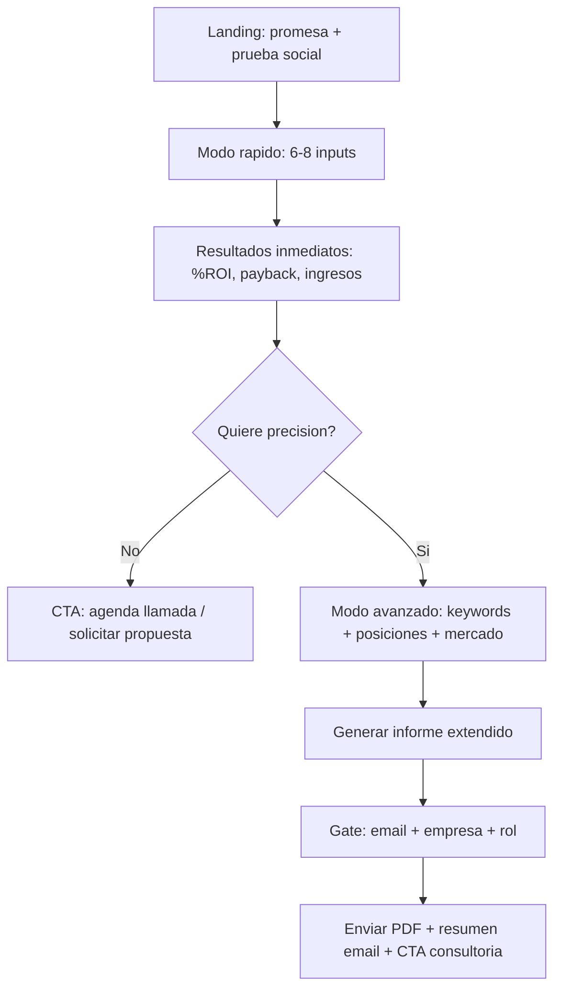
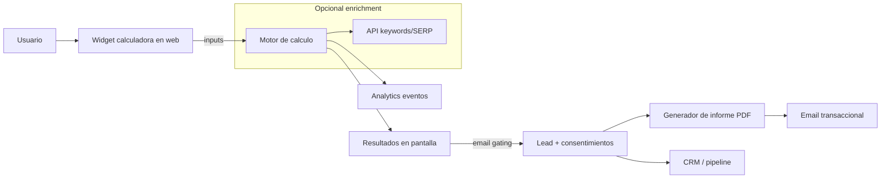

# Calculadora de SEO orgánico para Shiny Octopus

## Resumen ejecutivo

Crear una sección con una “calculadora” de SEO orgánico puede funcionar como **lead magnet de alto intent** y como **pieza de venta basada en valor** si cumple dos condiciones: (a) conecta *SEO → tráfico → conversiones → ingresos/beneficio* con supuestos claros y (b) reduce fricción (pocos inputs) pero ofrece profundidad cuando el usuario deja sus datos (informe extendido). Este enfoque está alineado con el patrón de “assessment/calculator” usado por agencias y SaaS para aumentar captación y conversión (widgets embebibles + reporte + CTA a consultoría). citeturn1view6turn10view1turn23search18

En el benchmark, se observa que las herramientas más efectivas combinan: **(1) escenarios (conservador/realista/agresivo)**, **(2) visualización inmediata de resultados** y **(3) un CTA fuerte a “estrategia/llamada”**. Ejemplos claros: páginas que prometen “proyecciones en minutos” y entregan un reporte (a veces PDF) con “dólares potenciales” y recomendaciones, y luego empujan a una reunión. citeturn9view0turn1view0turn11view2

Para la lógica de cálculo, conviene basarse en evidencias y fuentes “estándar” del sector: curvas CTR por posición (actualizadas por vertical y dispositivo), definiciones de “traffic potential”, y benchmarks de conversion rate por canal/industria. citeturn1view5turn2search0turn19view0 Además, el modelo debe incorporar el contexto 2024–2026: aumento de búsquedas “zero-click” y caída de CTR en muchas SERPs por features/AI Overviews, por lo que los supuestos deben ofrecer ajustes por tipo de consulta (informacional vs transaccional) y escenarios de “con o sin AIO”. citeturn13search1turn13search2turn13search22

Recomendación de producto: lanzar un **MVP en 2–4 semanas** con una calculadora de 2 pasos (rápida) + gating para informe detallado; y una **versión avanzada en 6–10 semanas** integrando (opcional) APIs de keyword/SERP o conexión a datos del cliente (p. ej., Search Console) para personalizar. La integración de datos “first‑party” (Search Console + Analytics) está respaldada como forma complementaria de entender rendimiento “antes y después de la visita”. citeturn13search15turn1view5

---

## Panorama del mercado: herramientas similares y propuestas de valor

### Observaciones generales del benchmark

Se identifican tres “familias” de herramientas similares:

1) **Calculadoras ROI/SEO para captar leads** (agencias): form → resultados → CTA (consulta, auditoría, presupuesto). Ej.: calculadoras en español con pestaña “Datos/Resultados” y CTA a consulta gratuita. citeturn11view2turn11view3turn1view3  
2) **Herramientas “semi‑producto” (SaaS) para agencias**: widgets embebibles, reportes “bonitos”, multi‑idioma, automatización y white‑label. citeturn8view0turn10view1turn9view0  
3) **Calculadoras de forecasting más “analíticas”** (keyword‑level / presets por industria): definen explícitamente fórmula “Search Volume × CTR × CVR × AOV” y permiten clústeres o tipo de página. citeturn18view3turn1view5

image_group{"layout":"carousel","aspect_ratio":"16:9","query":["My Web Audit ROI audit tool report sample","Nalaber AI Visibility SEO ROI calculator screenshot","SEO ROI calculator Spanish landing page ClickCrows","Search Scope SEO campaign ROI calculator interface"],"num_per_query":1}

### Listado comparativo de herramientas similares

> Nota: en la columna “Precio / lead magnet”, cuando no hay precio explícito, se describe el mecanismo de captación (p. ej., “consulta gratuita”, “email gating”, “trial”).

| Herramienta / página | Modelo de negocio | Público objetivo | Precio o lead magnet | Propuesta de valor (qué promete) | Señales de venta (CTA, outputs) |
|---|---|---|---|---|---|
| entity["company","My Web Audit","website audit saas"] (ROI audit tool / lead widgets/lead magnets) | SaaS B2B para agencias (suscripción por plan/credits; white‑label; widgets y lead magnets) citeturn8view0turn10view1turn9view0 | Agencias/freelancers web/SEO que venden proyectos y retainers citeturn8view0turn9view0turn10view0 | Plan desde **$69.99/mes** (Pro) según pricing público; “Start free trial” citeturn8view0turn10view1 | “Proyecciones en 5 minutos”, reportes de impacto financiero vs “mejoras técnicas” citeturn9view0 | “View sample report”, PDFs/links compartibles, CTA a “schedule consultation”, widgets (modal, slide‑in, full page) citeturn9view0turn10view1 |
| entity["organization","Nalaber","seo agency uk"] | Agencia SEO; calculadora como entrada a “strategy call” citeturn1view0 | Marcas/negocios (en web se comunica enfoque a resultados) citeturn1view0 | Lead magnet “Calculate your ROI” + “Free 30‑minute strategy call” citeturn1view0 | Enfatiza “revenue potencial” con breakdown (search tradicional + “AI assistants”) citeturn1view0 | Sliders con CR, valor cliente, “Potential ROI”, CTA directo a llamada citeturn1view0 |
| entity["organization","Growthack","digital agency uk"] | Agencia/herramientas gratis para adquisición | Marketers y pymes | Gratis; sin precio visible citeturn1view1 | ROI SEO por periodo con escenarios (conservador/realista/agresivo) y curva de crecimiento gradual citeturn1view1 | Form + “Projected ROI Results”; explica por qué SEO crece lento al inicio citeturn1view1 |
| entity["organization","Submerge","digital marketing agency uk"] | Agencia; calculadora + email gating | Negocios que evalúan inversión SEO | Gratis; “Get your results via email” (captura) citeturn4search4turn1view2 | Traduce SEO a leads/ingresos/profit/ROI; incorpora LTV y margen citeturn4search4turn1view2 | Requiere email para enviar resultados; educa sobre variables y horizonte (ej. 4–6 meses para tracción) citeturn4search4turn1view2 |
| entity["organization","Chili","marketing agency panama"] | Agencia; calculadora como pre‑venta de consultoría SEO citeturn1view3 | Negocios en español | Resultados “desbloqueados” vía formulario; disclaimer fuerte de “orientativo” citeturn1view3 | Estima visitas, conversiones, ingresos, LTV y ROI citeturn1view3 | Inputs tipo “volumen de búsqueda” y CTR; CTA implícito a consultoría/campaña citeturn1view3 |
| entity["organization","ClickCrows","seo agency spain"] | Agencia SEO; calculadora como captación (consulta gratis) citeturn11view2 | Pymes hispanohablantes | Gratis; CTA “Consulta SEO gratuita” citeturn11view2 | Compara “sin SEO vs con SEO”; incluye payback (periodo de recuperación) citeturn11view2 | Pestañas “Datos/Resultados”; disclaimer de variabilidad; CTA final a consulta citeturn11view2 |
| entity["organization","SEOtopsecret","seo agency mexico"] | Agencia; calculadora anual con CTA a “discutir resultados” citeturn11view3 | eCommerce / Lead gen | Gratis; CTA a hablar resultados citeturn11view3 | Inputs simples (tráfico anual, CR lead, close rate, valor cliente, crecimiento) citeturn11view3 | Botón “Discutir mis resultados”; desglose de tráfico/clientes/ingresos/ROI citeturn11view3 |
| entity["people","Félix Álvarez","seo consultant spain"] | Consultoría; calculadora como entrada a formulario | Pymes/marketers en español | Gratis; formulario de contacto post‑resultado citeturn18view0 | ROI y “cuántos meses tardará” el SEO en generar beneficios citeturn18view0 | Inputs mínimos (inversión, ingresos estimados, meses); CTA de contacto citeturn18view0 |
| entity["people","Aleyda Solis","seo consultant"] | Personal brand + herramientas; foco en break-even | Profesionales/empresas | Gratis; calcula punto de equilibrio con CR y valor conversión citeturn18view1 | “Break-even conversions & visits” para justificar inversión SEO (nació para international SEO, aplica general) citeturn18view1 | Output orientado a “cuánto necesitas convertir” para repagar un proyecto citeturn18view1 |
| entity["organization","Search Scope","seo agency australia"] | Agencia; herramienta avanzada de forecasting SEO citeturn18view3 | Marketers con mentalidad analítica | Gratis; posiciona como método “data‑driven” citeturn18view3 | ROI por keyword, clúster o tipo de página; presets por industria; fórmula explícita citeturn18view3 | “Quick start presets”, escenarios (opt/real/cons), referencias a benchmarks citeturn18view3 |
| entity["organization","WebFX","marketing agency us"] | Agencia; contenido educativo + calculadora simple citeturn18view2 | Negocios que quieren medir ROI | Calculadora ROI genérica; CTA “Get professional help” citeturn18view2 | Estructura en 3 pasos: inversión, tracking de conversiones, cálculo ROI citeturn18view2 | Demuestra set‑up GA4/ecommerce vs lead gen; guía detallada citeturn18view2 |
| entity["organization","MADX","seo agency for saas"] | Agencia SaaS SEO; herramienta + CTA “book a call / free audit” citeturn12search35 | SaaS | Gratis; gating hacia auditoría/llamada citeturn12search35 | Conecta ROI a conversiones e ingresos; insiste en “calidad inputs = calidad output” citeturn12search35 | FAQ con fórmula estándar, CTA a “Free Audit / Book a Call” citeturn12search35 |

### URLs del benchmark

> Por restricciones de formato, incluyo las URLs en un bloque de texto.

```txt
My Web Audit (pricing): https://www.mywebaudit.com/pricing
My Web Audit (ROI audit tool): https://www.mywebaudit.com/template/return-on-investment-template
My Web Audit (lead magnets): https://www.mywebaudit.com/agency-lead-magnets
My Web Audit (lead widgets): https://www.mywebaudit.com/lead-widgets

Nalaber: https://nalaber.com/

Growthack SEO ROI Calculator: https://growthack.io/tools/seo-roi-calculator/
Submerge SEO ROI calculator: https://submerge.digital/resources/free-digital-marketing-calculators/seo-roi-calculator/
Chili ROI SEO: https://chili.pa/es/calculadora-roi-seo/
ClickCrows ROI SEO: https://clickcrows.com/calculadora-seo-roi/
SEOtopsecret ROI SEO: https://www.seotopsecret.com/calculadora-de-retorno-de-inversion-de-seo
Félix Álvarez ROI SEO: https://felixalvarez.com/calculadora-roi-seo/
Aleyda Solis ROI calculator: https://www.aleydasolis.com/en/seo-resources-tools/roi-calculator/
Search Scope SEO ROI Calculator: https://searchscope.com.au/seo-campaign-roi-calculator/
WebFX SEO ROI: https://www.webfx.com/seo/learn/seo-roi/
MADX SEO ROI calculator: https://www.madx.digital/tools/seo-roi-calculator
```

---

## Cómo venden estas herramientas: mensajes, CTAs y ejemplos de outputs

### Mensajes que convierten (patrones repetidos)

Un patrón constante es **mover la conversación de “SEO como táctica” a “SEO como inversión”**. La promesa se formula como: *“te mostramos el dinero que estás dejando sobre la mesa”* o *“cuánto podrías ganar si capturas X% del tráfico potencial”*. Ejemplo: Nalaber plantea “revenue you’re leaving on the table” y muestra un “Potential Annual Revenue” con breakdown. citeturn1view0

En B2B “agency enablement”, My Web Audit es explícito: el diferencial no son mejoras técnicas sino “dollar projections” para justificar fees y responder “will this be worth it?”. citeturn9view0turn1view6

En calculadoras hispanas, el ángulo vendedor suele ser: *“visualiza el ROI” + “consulta gratuita”*. ClickCrows añade un elemento clave de persuasión: **payback (“período de recuperación”)** y comparativa “sin SEO vs con SEO”, además de un disclaimer (no garantías) que reduce riesgo percibido/legal. citeturn11view2

### CTAs y estructura de landing

Los CTAs frecuentes se agrupan en 3 niveles:

- **CTA de bajo compromiso:** “Calcular”, “Ver resultados”, “Probar herramienta”. (Reduce fricción.) citeturn1view1turn11view2  
- **CTA de captura:** “Recibe el informe por email” / “Desbloquea el reporte”. (Convierte curiosidad en lead.) citeturn4search4turn1view2  
- **CTA de venta:** “Agenda una llamada” / “Consulta gratuita” / “Discutir mis resultados”. (Empuja a cierre consultivo.) citeturn11view3turn1view0turn9view0  

My Web Audit añade un patrón especialmente potente: **widget embebible → mini‑reporte teaser → CTA a consulta**. Es una ruta diseñada para transformar un visitante “frío” en un lead ya “pre‑educado” con insights personalizados. citeturn10view0turn10view1

### Demos, informes y ejemplos de output

Hay tres formatos de “output” recurrentes:

1) **Resultados en pantalla (instantáneo)**: KPI cards (tráfico, conversiones, ingresos, ROI) y sliders para “jugar” escenarios. citeturn1view0turn11view2  
2) **Reporte descargable / shareable (PDF o link)**: My Web Audit destaca PDFs y links compartibles y reportes “branded”. citeturn9view0turn8view0  
3) **Email report (gated)**: Submerge y otros piden email para enviar resultados y activar nurturing. citeturn4search4turn1view2  

Un detalle de UX que aparece en herramientas más maduras: **ayuda contextual con benchmarks** (tooltips “?”), como hace YourContentMart (orientado a SaaS) al sugerir “hover tips” y explicar qué incluir en el presupuesto SEO. citeturn11view0

### Disclaimers como elemento de confianza

Es habitual y recomendable incluir un disclaimer de: “estimaciones orientativas, resultados pueden variar” y “no constituye garantía”. Chili lo formula de forma explícita (actualizaciones sin aviso; no responsabilidad por decisiones basadas en resultados). citeturn1view3  
Este patrón reduce riesgo legal y, paradójicamente, **aumenta credibilidad** (porque muestra prudencia y transparencia).

---

## Diseño de la calculadora recomendada: KPIs, inputs, supuestos y lógica

### Supuestos explícitos para Shiny Octopus

| Variable no definida | Supuesto recomendado (para MVP) | Por qué |
|---|---|---|
| Idioma del producto | Español (es‑AR / es‑ES neutro) | Coherente con el sitio en español y reduce fricción en LATAM/ES. citeturn22view0 |
| Público objetivo | Pymes, marcas y profesionales que ya invierten en web y dudan de SEO | Shiny Octopus se posiciona como estudio de diseño/desarrollo orientado a conversión y “ser encontrada”. citeturn22view0 |
| Nivel técnico del equipo | Bajo‑medio (pueden integrar un widget; backend ligero) | Adecuado para un MVP rápido (sin integraciones complejas). |
| Presupuesto típico del cliente | No se fija; se pide input y se ofrecen presets | Evita sesgo y permite escenario por sensibilidad. |

### Qué debe calcular (KPIs y métricas) y por qué

La calculadora debe combinar **métricas de demanda (SERP)** con **métricas de negocio**:

**Demanda / visibilidad**
- **Tráfico potencial por keyword o clúster**: usar “traffic potential” como concepto superior a “search volume” cuando es posible (porque una página #1 suele rankear por muchos términos). citeturn2search0turn2search6  
- **CTR estimado por posición (y por SERP features)**: basarse en curvas actualizadas. Advanced Web Ranking publica benchmarks “fresh… pulled monthly” y declara que el origen es Search Console. citeturn1view5turn0search2  
- **Ajuste por zero‑click / AI Overviews**: incorporar un “factor de reducción” opcional para queries informacionales, dada la evidencia de caída de CTR y aumento de zero‑click. citeturn13search1turn13search2turn13search22  

**Rendimiento comercial**
- **Conversion rate (CVR) esperado**: permitir input y ofrecer presets por industria/canal. First Page Sage reporta benchmarks por canal donde SEO aparece con conversion rates promedio (B2B/B2C) y tabla por industrias. citeturn19view0  
- **Valor por conversión**: AOV (ecommerce) o “valor lead” (lead gen), o LTV/CLV si aplica; muchas calculadoras usan LTV para reflejar realidad comercial. citeturn4search4turn1view3turn10view0  
- **Margen / beneficio**: para evitar “inflar” ROI usando revenue bruto (Submerge trabaja con profit y margen). citeturn1view2  

**Retorno y timing**
- **ROI (%)**: fórmula estándar: (Revenue − Cost) / Cost (la misma que explica Semrush para SEO ROI, y que se replica en guías del sector). citeturn2search1turn18view2  
- **Payback (meses)**: muy “vendible” para CFO/decisor (ClickCrows lo incluye como “período de recuperación”). citeturn11view2  
- **Tiempo a resultados (rampa)**: incorporar un modelo de crecimiento gradual (como Growthack) y evidencias de tiempos de ranking/resultados: encuestas y estudios de Ahrefs sobre cuánto tarda SEO en mostrar resultados y sobre antigüedad/velocidad de ranking. citeturn1view1turn2search17turn2search2  

**Coste de oportunidad**
- **Equivalente en Ads del tráfico orgánico**: estimar el “valor” del tráfico orgánico como “lo que costaría comprarlo” con CPC; este enfoque lo explica una calculadora de “valor del tráfico orgánico” (comparación con ads) y también existe evidencia académica sobre usar CPC como “costo económico” de keywords orgánicas. citeturn1view4turn15view1  

### Tabla de KPIs propuestos para la calculadora

| KPI | Qué responde | Fórmula / método | Fuente recomendada |
|---|---|---|---|
| Tráfico orgánico potencial mensual | “¿Cuánto tráfico podría capturar si mejoro posiciones?” | Σ(Search volume × CTR_pos) por keyword/clúster; o usar “traffic potential” cuando aplique | Curvas CTR: AWR citeturn1view5; “Traffic potential”: Ahrefs citeturn2search0 |
| Clicks incrementales estimados | “¿Cuánto gano vs hoy?” | Clicks_target − Clicks_current (por escenario) | AWR + datos actuales (si el usuario los tiene) citeturn1view5turn13search15 |
| Conversiones incrementales | “¿Cuántos leads/ventas extra?” | Clicks_incrementales × CVR | Benchmarks CVR: First Page Sage citeturn19view0; input propio |
| Ingresos incrementales | “¿Cuánto ingreso adicional?” | Conv_inc × Valor_por_conv (AOV o valor lead o LTV) | Práctica estándar en calculadoras ROI SEO citeturn1view3turn4search4turn18view3 |
| Beneficio incremental | “¿Cuánto beneficio real?” | Ingresos_inc × margen | Submerge (profit/margin) citeturn1view2 |
| ROI (%) | “¿Vale la inversión?” | (Beneficio_inc − Coste_SEO) / Coste_SEO | Semrush citeturn2search1; WebFX citeturn18view2 |
| Payback (meses) | “¿Cuándo recupero?” | Mes donde acumulado beneficio ≥ acumulado coste | ClickCrows lo comunica como KPI clave citeturn11view2 |
| Valor equivalente en Ads | “¿Cuánto me ‘ahorra’ el SEO vs Ads?” | Clicks_org × CPC_estimado | Enfoque CPC‑equivalente: ralfvanveen citeturn1view4; CPC como proxy económico: ScienceDirect abstract citeturn15view1 |
| Riesgo “zero‑click / AIO” (escenario) | “¿Cuánto cambia el resultado si baja el CTR?” | Multiplicador sobre CTR (p. ej. −X%) por tipo de query | SparkToro / Similarweb / Seer / Ahrefs AIO citeturn13search1turn13search0turn13search2turn13search22 |

### Inputs mínimos y supuestos por defecto

Un buen diseño separa **inputs obligatorios (mínimos)** de **inputs opcionales (mejoran precisión)**:

**Inputs obligatorios (modo rápido, 60–90 segundos)**
- Tipo de negocio: ecommerce vs lead gen (selector).
- País/mercado principal (para adaptar CTR/CVR y lenguaje).
- Objetivo principal: ventas / leads / reservas / suscripciones.
- Valor por conversión (AOV o “valor lead”).
- Conversion rate actual (o “no lo sé” → usar preset).
- Inversión mensual prevista en SEO.

**Supuestos por defecto (si el usuario no sabe)**
- CVR por canal/industria: usar presets (p. ej., SEO B2B/B2C) y permitir editar; First Page Sage publica benchmarks por canal e industrias, útil como “default con fuente”. citeturn19view0  
- Crecimiento “rampa”: curva gradual (p. ej., lenta al inicio), inspirado en calculadoras que modelan naturaleza gradual del SEO. citeturn1view1turn1view7  
- Escenarios (conservador/realista/agresivo): recomendado para evitar sobre‑promesa; aparece como patrón en herramientas. citeturn1view1turn18view3turn9view0  

**Inputs opcionales (modo avanzado)**
- Lista de keywords o categorías (3–10 términos).
- Posición actual aproximada (si la conoce) o “no rankea”.
- Tráfico orgánico actual (de Search Console/Analytics).
- Competidores (dominios) para benchmark (si queréis incluir “gap”).

### Lógica de cálculo propuesta (MVP)

Para que sea explicable y “vendible”, la lógica debe ser simple pero defensible (con escenarios). Una forma robusta:

1) Estimar **clicks potenciales** (por posición) combinando search volume y CTR. citeturn1view5turn18view3  
2) Ajustar por **zero‑click/AIO** con un multiplicador opcional (escenario). citeturn13search22turn13search1  
3) Convertir clicks → conversiones con CVR (input o benchmark). citeturn19view0  
4) Conversiones → ingresos/beneficio con valor por conversión y margen. citeturn1view2  
5) Calcular ROI y payback. citeturn2search1turn11view2  

#### Diagrama de flujo de uso (MVP)



---

## Formatos de entrega, UX/UI y copy sugerido

### Formatos de entrega recomendados (y para qué sirven)

**Widget interactivo embebible (principal)**  
El patrón “widget” es poderoso porque vive en páginas de servicio y convierte tráfico “de blog” o “de portfolio” en leads, como se ve en soluciones SaaS para agencias. citeturn10view1turn10view0

**Informe descargable (PDF) + link compartible (para decisores)**  
Útil cuando el usuario necesita “llevarlo al socio/CFO”. El ejemplo fuerte es el enfoque de reportes branded y compartibles. citeturn9view0turn8view0

**Informe por email (nurture)**  
Gating por email es común y efectivo para alimentar secuencias; Submerge lo usa explícitamente. citeturn4search4turn1view2

**Upsell a consultoría**  
CTA directo “discutir resultados / agenda llamada” aparece como cierre natural (especialmente cuando ya “vieron el número”). citeturn11view3turn1view0turn11view2

### Recomendaciones UX/UI concretas

**Estructura sugerida de la sección**
- Hero con promesa tangible (resultado financiero) + subtexto de prudencia (“estimación”).
- Bloque “cómo funciona” en 3 pasos (inputs → proyecciones → plan), alineado al patrón de herramientas que explican “how it works”. citeturn1view5turn9view0turn1view1  
- Widget en 2 pasos (progresivo): primero inputs mínimos; luego mostrar resultados; después ofrecer “informe completo” (email).  
- Prueba social: logos/casos, o “ejemplo de reporte” (My Web Audit y Nalaber lo usan como “view sample / case studies”). citeturn9view0turn1view0

**Principios de micro‑UX que aumentan conversión**
- Tooltips “?” con benchmarks y definiciones (reduce abandono). citeturn11view0  
- Escenarios preconfigurados (conservador/realista/agresivo) para gestionar expectativa y aumentar confianza. citeturn1view1turn18view3turn9view0  
- Mostrar *primero* un resultado “wow but plausible” (p. ej., rango) y *después* pedir email para “desglosar por páginas/acciones”. Este patrón coincide con “teaser → CTA”. citeturn10view0turn9view0

### Mockup textual del output (ejemplo de métricas visuales)

**Pantalla de resultados (arriba, 4 tarjetas)**
- ROI estimado (rango): 180%–420%
- Payback estimado: 7–11 meses
- Ingresos incrementales/mes: $X–$Y
- Tráfico orgánico incremental/mes: +A–+B clicks

**Visualizaciones**
- Gráfico “waterfall” (hoy → potencial): clicks → leads/ventas → ingresos → beneficio → ROI.
- Gráfico “curva de crecimiento” por mes (0–18 meses) con 3 escenarios (cons/real/agr), inspirado en el concepto de rampa gradual. citeturn1view1turn2search17  
- Barra “riesgo SERP”: toggle “SERP con AI Overviews / alta zero‑click” que reduce CTR en escenario informacional. citeturn13search22turn13search0  

### Copy sugerido para la landing

**Hero (opción A, directa)**
- Título: “Calcula cuánto negocio podrías ganar con SEO orgánico.”
- Subtítulo: “En 90 segundos: tráfico potencial, conversiones y ROI estimado. Sin promesas mágicas: supuestos claros y escenarios.”
- CTA principal: “Quiero mi estimación”
- CTA secundario: “Ver ejemplo de informe”

**Bloque de confianza**
- “Datos orientativos basados en benchmarks de CTR y tasas de conversión. Los resultados reales dependen de tu mercado, tu web y la ejecución.” (Inspirado en disclaimers habituales.) citeturn1view3turn11view2

**Sección “qué obtienes”**
- “Un rango de ROI y payback”
- “Un plan priorizado de acciones (impacto vs esfuerzo)”
- “Un informe para compartir con tu equipo”

### Microcopy recomendado dentro de la herramienta

- Campo CVR: “¿No lo sabes? Usa el promedio de tu industria (puedes ajustarlo después).”
- Campo valor conversión: “Si vendes servicios: usa el valor promedio de un lead *cerrado* (o tu LTV si lo tienes).”
- Escenarios: “Conservador = menos clicks (SERP más ‘zero‑click’) y rampa más lenta.”
- Botón final: “Generar mi informe (PDF + email)”
- Bajo el botón: “Sin spam. Te enviaremos el resumen y, si quieres, una propuesta de roadmap.”

---

## Monetización y pricing sugeridos

### Modelos viables (de menor a mayor fricción)

**Gratis (lead gen puro)**  
Objetivo: maximizar volumen de leads. Se monetiza con consultoría/proyecto. Es el patrón dominante en calculadoras de agencias (CTA a consulta gratuita / discutir resultados). citeturn11view2turn11view3turn1view0

**Freemium (gratis + informe completo con email)**  
- Gratis: resultados básicos (rango ROI, payback).
- “Unlock”: informe completo por email (captura de lead) + CTA a diagnóstico.
Este patrón es coherente con “Get results via email” en Submerge. citeturn4search4turn1view2

**Pago por informe (ticket bajo/medio)**  
Vender un “Informe SEO de oportunidad” (p. ej., $29–$199) que incluya: keyword clusters, potencial por página, backlog priorizado. Debe justificar valor como “lo que normalmente tardas horas en preparar”. El framing “ahorra horas / entrega en minutos” es un gancho que My Web Audit explota para vender su herramienta. citeturn9view0turn1view6

**Suscripción (si queréis productizar)**  
Solo recomendable si Shiny Octopus quiere convertirse en “tooling” recurrente (más parecido a SaaS). Aquí el benchmark útil es el pricing y estructura de planes por créditos/funcionalidades. citeturn8view0turn10view1

### Sugerencia de pricing (orientativa) para Shiny Octopus

- **Gratis:** calculadora + mini‑informe en pantalla + CTA a llamada (principal).
- **Informe Pro (pago único):** “Roadmap SEO + proyección 12–18 meses” (si tenéis capacidad de entrega consistente).
- **Consultoría / Proyecto:** paquete “Diagnóstico + Plan + Implementación” (la calculadora alimenta el valor percibido).

La razón de mantenerlo gratis (al menos al inicio) es que el valor real suele capturarse en el **proyecto de ejecución**, y el lead llega con “fricción buena” (ya ha modelado números), lo que incrementa intención (Typeform menciona el comportamiento “jugar con tu ROI calculator” como señal de alta intención en lead generation). citeturn23search18

---

## Plan de implementación técnico

### Enfoque de implementación recomendado

**Opción MVP “sin integraciones” (rápida, 2–4 semanas)**  
- Inputs manuales + presets.
- Curva CTR por posición (usando benchmarks públicos) y CVR por industria/canal.
- Export PDF y email.
- Analytics de uso (eventos: start, complete, submit email, book call).

**Opción “data‑enriched” (6–10 semanas)**  
- Añadir (opcional) **keyword/SERP enrichment**: el usuario pega 3–10 keywords y el sistema devuelve volúmenes/serp features/estimaciones.  
- Si necesitáis API externa, proveedores de datos tipo entity["company","DataForSEO","seo data api provider"] publican pricing por request y modelo pay‑as‑you‑go (mínimo de pago) y costes “from $0.0006 per request” para SERP API, útiles para estimar coste variable. citeturn23search7turn23search23

**Opción “first‑party” (más precisa, requiere OAuth)**
- Conexión a Search Console para obtener impresiones/clicks/posiciones reales y estimar uplift.  
- Google recomienda usar Search Console y Analytics juntos para entender rendimiento antes y después de la visita. citeturn13search15turn1view5  
*(Esta opción aumenta confianza del output pero sube fricción: requiere permisos/propiedad verificada.)*

### Stack sugerido

**Frontend**
- Widget en React/Preact o Web Component embebible (para insertarlo en cualquier página del sitio sin re‑arquitectura).
- Estilos aislados (CSS scope) para no romper la web.

**Backend**
- Serverless (Vercel/Netlify/Cloudflare Workers) con endpoint:
  - `POST /calculate` (devuelve JSON con KPIs + escenarios)
  - `POST /report` (genera PDF + envía email)
- Persistencia: Postgres o un KV (según necesidad) para guardar leads/resultados (cumpliendo privacidad).

**PDF + email**
- Render HTML→PDF (headless) y envío por proveedor email transaccional.
- Guardar “snapshot” de supuestos usados en el PDF (transparencia).

**CRM**
- Enviar lead a CRM (HubSpot, etc.) o a herramientas de automatización (Zapier/Make). (My Web Audit enfatiza integraciones con Zapier/Make/CRMs como parte del flujo agency.) citeturn8view0turn10view1

### Arquitectura de datos propuesta



### Requisitos de datos y compliance

- Guardar: inputs, output, escenario, timestamp, y consentimiento.
- Mostrar claramente:
  - “Estimación orientativa”.
  - “Qué benchmarks se usan” (CTR, CVR) y posibilidad de editar.
- Incluir disclaimer similar al estándar observado en calculadoras (resultados pueden variar; no garantía). citeturn1view3turn11view2

### Estimación de tiempo y recursos

**MVP (2–4 semanas)**
- 1 dev frontend (widget) + 1 dev full‑stack ligero (serverless + PDF/email) + 1 diseñador (UI) + 1 copy/estratega (mensajes + microcopy).
- Entregables: calculadora rápida, resultados en pantalla, email con resumen, CTA a reunión, tracking básico.

**Versión avanzada (6–10 semanas total)**
- Añadir: modo avanzado con keywords, presets por industria, mejoras de visualización (waterfall, curva), panel interno de leads.
- Opcional: integración con API de datos (coste variable) o Search Console (OAuth).

Si el equipo quiere evitar desarrollo, existen plataformas no‑code orientadas a crear y embeber calculadoras con foco en lead gen (por ejemplo, entity["company","Outgrow","interactive calculator builder"] y entity["company","ConvertCalculator","calculator builder platform"] describen creación de calculators/assessments y embebido en web; ConvertCalculator incluso documenta embebido vía JS). citeturn23search0turn23search1turn23search17  
*(Aun así, para una calculadora SEO “seria” con su propia lógica/benchmarks, el desarrollo a medida suele dar más control de supuestos y diferenciación.)*